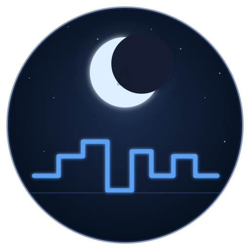

# DeltaSleep

<p align="center">
  
</p>

> **Your sleep data stays in your bed.**

Free, open-source Android app for sleep phase and snore tracking. Every byte of analysis happens on your device. The app ships without the `INTERNET` permission and a CI job verifies this on every commit.

**[Website](https://ntufar.github.io/DeltaSleep)** · **[Changelog](CHANGELOG.md)** · **[F-Droid](https://f-droid.org)** *(planned)*

---

## Features (v0.1 MVP)

| | |
|---|---|
| **Sleep phases** | Awake / Light / Deep classified every 30 s via audio heuristics |
| **Snore detection** | Spectral band-power analysis (20–300 Hz), per-epoch yes/no flag |
| **Hypnogram** | On-device canvas chart, color-coded by phase |
| **CSV export** | Full epoch data to any folder via the system file picker |
| **Zero network** | No analytics, no crash reporting, no telemetry — ever |

## Privacy guarantees

- `INTERNET` permission is **absent** from the manifest
- CI fails if `http`, `socket`, `URL`, or `fetch` appear in source
- Only three permissions requested: `RECORD_AUDIO`, `FOREGROUND_SERVICE`, `POST_NOTIFICATIONS`
- Raw audio is never written to disk
- "Delete all data" overwrites the database before deletion

## Architecture

```
Jetpack Compose UI
      │
      ▼
Room (SQLite, app-private)   ←   SleepTrackingService (foreground)
                                        │
                                        ▼
                              EpochProcessor (Kotlin)
                                        │
                                        ▼
                              DspBridge (JNI)
                                        │
                                        ▼
                       libdeltasleep_dsp.so  (Rust via NDK)
                       └── features.rs  (RMS · ZCR · IIR band-pass)
                       └── classifier.rs (Awake / Light / Deep)
                       └── snore.rs     (band-ratio threshold)
```

Audio is captured at 16 kHz in 10 ms frames. The Rust library accumulates features for 30 s, classifies the epoch, and discards the PCM. The foreground service writes one `SleepEpoch` row per 30 s to SQLite.

## Building

### Prerequisites

```bash
# Rust targets for Android
rustup target add aarch64-linux-android x86_64-linux-android
cargo install cargo-ndk

# Android NDK r26+ via Android Studio or sdkmanager
# Java 17 (Temurin recommended)

# Gradle wrapper (one-time, requires Gradle 8.6 on PATH)
gradle wrapper --gradle-version 8.6
```

### Commands

```bash
# Build debug APK (also compiles Rust DSP automatically)
./gradlew :app:assembleDebug

# Install on connected device
./gradlew :app:installDebug

# Rust DSP only
cd dsp && cargo ndk -t arm64-v8a -t x86_64 -o ../app/src/main/jniLibs build --release

# Privacy check (must return no matches)
grep -rE '\b(http|socket|URL|fetch)\b' app/src/main/java/
```

## Tech stack

| Layer | Technology |
|---|---|
| UI | Kotlin + Jetpack Compose |
| Database | Room (SQLite) |
| DSP | Rust → `.so` via Android NDK |
| Build | Gradle 8.6 + cargo-ndk |
| Min SDK | Android 8.0 (API 26) |

## License

GPLv3 — if you improve it, everyone benefits. See [LICENSE](LICENSE).
